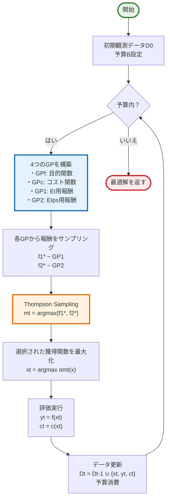
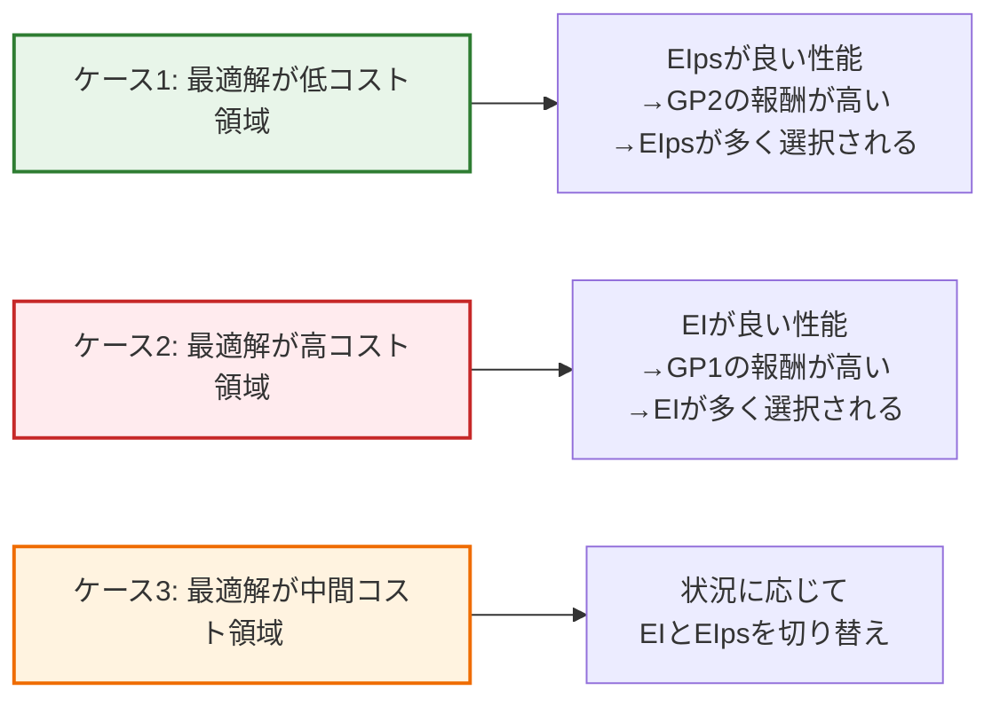
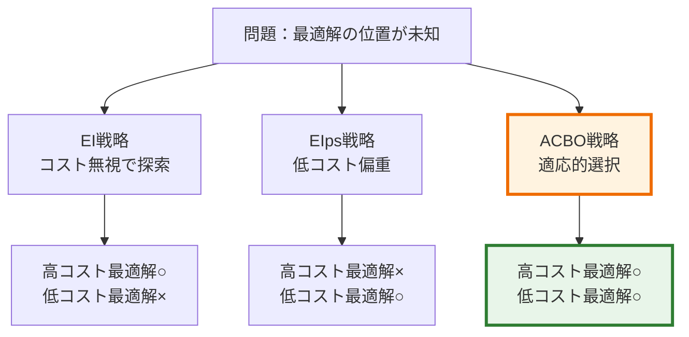

# ACBO (Adaptive Cost-Aware Bayesian Optimization) 解説

## 1. ACBOの革新

### 従来のコスト考慮BO手法の問題点

#### EIps (Expected Improvement per second)
- **長所**: 低コスト領域を重点的に探索、計算効率が良い
- **短所**: 最適解が高コスト領域にある場合、性能が著しく低下
- **仕組み**: EI値をコストで除算（α_EIps(x) = α_EI(x) / c(x)）

#### EI-cool (CArBO)
- **長所**: 残り予算に応じて戦略を切り替え
- **短所**: 初期はEIps的動作で固定、柔軟性に欠ける
- **仕組み**: クーリングパラメータλで段階的に切り替え

### ACBOの解決策

**「Multi-Armed Bandit (MAB)を用いて、EIとEIpsを動的に選択」**

- 最適解の位置（低コスト/高コスト領域）を事前に仮定しない
- Thompson Samplingで各戦略の性能を学習しながら適応的に選択
- 結果：様々な問題設定で安定した高性能を実現

## 2. ACBOの核心：MABによる獲得関数選択

### 2.1 問題設定

```
目的：限られた予算B内で、ブラックボックス関数f(x)を最大化
制約：各評価にコストc(x)が発生、総コスト ≤ B
```

### 2.2 アルゴリズムの流れ



### 2.3 報酬モデリングの詳細

#### 各獲得関数の報酬分布
- **EI用（GP1）**: EIで取得したデータから最大値f*の事後分布を学習
- **EIps用（GP2）**: EIpsで取得したデータから最大値f*の事後分布を学習

#### Thompson Sampling
1. 各GPから関数をサンプル：f̃m ~ GPm
2. 最大値を計算：f̃m* = max f̃m(x)
3. より高いf*を持つ獲得関数を選択

## 3. なぜACBOが優れているのか

### 3.1 適応性のメカニズム



### 3.2 収束性の保証

1. **EIpsが停滞した場合**
   - GP2の報酬が向上しなくなる
   - Thompson Samplingの理論により「飽和アーム」として扱われる
   - 自動的にEIへ切り替わる

2. **最適戦略の学習**
   - 反復が進むにつれ、各戦略の真の性能が明確に
   - より良い戦略が高確率で選択されるように収束

## 4. 実験結果の要点

### 4.1 合成関数での評価

| 関数 | 次元 | ACBOの優位性 |
|------|------|-------------|
| Rastrigin | 3 | 全予算領域で最良または同等 |
| Alpine | 4 | 後半で大幅に優位 |
| Ackley | 5 | 高次元で特に効果的 |
| Hartman | 6 | EI/EIps単独より安定 |
| Michalewicz | 10 | 複雑な問題で圧倒的優位 |

### 4.2 実世界応用

#### ハイパーパラメータ最適化（21個のUCIデータセット）
- **結果**: 21データセット中12個で既存手法と同等、4個で優位
- **特徴**: 最適解のコストが未知な状況で安定した性能

#### ロボット探査シミュレーション
- **タスク**: 銅濃度が最大の地点を探索
- **コスト**: 掘削深度に比例
- **結果**: 予算の80%使用後、他手法を大幅に上回る性能

### 4.3 性能向上の要因



## 5. 実装のポイント

### Algorithm 1: ACBO

```python
# 疑似コード
while used_budget < B:
    # 4つのGPを構築
    fit GPf, GPc using Dt-1  # 目的関数とコスト
    fit GP1 using Dt-1,1     # EI用データ
    fit GP2 using Dt-1,2     # EIps用データ

    # Thompson Sampling
    for m in {1, 2}:
        f̃m ~ GPm
        f̃m* = max f̃m(x)

    # 獲得関数選択
    mt = argmax{f̃1*, f̃2*}

    # 次の評価点を決定
    if mt == 1:
        xt = argmax EI(x)
    else:
        xt = argmax EIps(x)

    # 評価と更新
    yt, ct = f(xt), c(xt)
    Update Dt, Dt,mt
    used_budget += ct
```

### 実装上の重要点

1. **GPの構築**: Squared Exponential kernelを使用
2. **Thompson Sampling**: 1000個のランダムフーリエ特徴量を使用
3. **最適化**: multi-start L-BFGSまたはDIRECT
4. **初期点**: すべての手法で同一の初期点セットを使用

## 6. ACBOの意義と今後の展開

### 主要な貢献

1. **柔軟性**: 最適解の位置を事前に仮定不要
2. **理論的保証**: Thompson Samplingによる収束性
3. **実用性**: 実装が簡単で拡張可能
4. **汎用性**: 様々な問題設定で安定した性能

### 拡張の可能性

- 3つ以上の獲得関数の組み合わせ
- より複雑なコスト構造への対応
- 並列評価への拡張

## まとめ

ACBOは、**MABを用いて複数の獲得関数を動的に選択**することで、従来手法の「最適解の位置を仮定する」という制約を克服。実験により、様々な問題設定で**安定かつ高い性能**を実現することを実証。特に**最適解の位置が未知**の実問題において有効な手法。