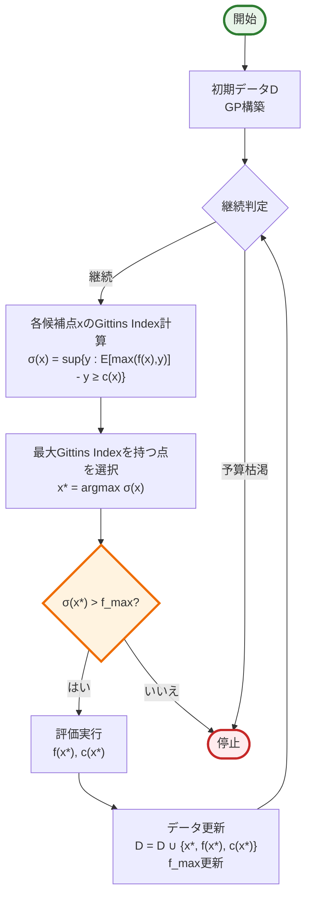
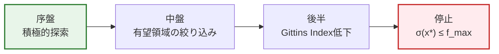

# CAStoP (Cost-aware Stopping for Bayesian Optimization) 解説

## 1. CAStoPの革新

### 従来のBO停止基準の問題点

#### 固定予算方式
- **問題**: 予算を使い切るまで探索を継続
- **欠点**: 改善が見込めない場合でも無駄な評価を実行

#### ヒューリスティック基準
- **問題**: 理論的保証がない
- **欠点**: 早期停止で最適解を逃すリスク

### CAStoPの解決策

**「Pandora's Box Gittins Index理論に基づく最適停止戦略」**

- 各候補点の「開く価値」を理論的に評価
- 期待改善値とコストのトレードオフを最適化
- 結果：無駄な評価を削減しながら高性能を維持

## 2. 理論的基盤：Pandora's Box問題

### 2.1 問題設定

```
N個の箱があり、各箱i：
- 開封コスト：ci
- 報酬分布：Fi（事前にわかっている）
- 目的：期待純利益を最大化する順序で箱を開く
```

### 2.2 Gittins Index

各箱のGittins Index：
$$\sigma_i = \sup\{y : \mathbb{E}[\max(X_i, y)] - y \geq c_i\}$$

ここで：
- $X_i \sim F_i$：箱iから得られる報酬
- $y$：既知の最大報酬（外部オプション）
- $c_i$：箱iを開くコスト

**最適戦略**: Gittins Indexが最大の箱から順に開く

## 3. CAStoPアルゴリズム

### 3.1 アルゴリズムフロー



### 3.2 Gittins Index計算の詳細


## 4. 停止条件の理論的保証

### 4.1 最適性の保証

Gittins Index理論により：
- 各ステップで期待純利益を最大化
- 停止時点で追加評価の期待利益 < コスト

### 4.2 累積コストの期待値

$$\mathbb{E}[\text{累積コスト}] \leq \sum_{i: \sigma_i > f^*} c_i$$

ここで$f^*$は真の最大値

## 5. 実装のポイント

### Algorithm 1: CAStoP

```python
# 疑似コード
D = initial_data
f_max = max(D.y)

while budget_remaining > 0:
    # GPモデル構築
    fit GP_f, GP_c using D
    
    # 各候補点のGittins Index計算
    for x in candidate_points:
        μ, σ² = GP_f.predict(x)
        c = GP_c.predict(x)
        σ(x) = compute_gittins_index(μ, σ², c)
    
    # 最大Gittins Indexの点を選択
    x* = argmax σ(x)
    
    # 停止判定
    if σ(x*) <= f_max:
        break  # 停止
    
    # 評価実行
    y = f(x*)
    cost = c(x*)
    
    # 更新
    D = D ∪ {x*, y, cost}
    f_max = max(f_max, y)
    budget_remaining -= cost
```

### 5.1 Gittins Index計算

```python
def compute_gittins_index(μ, σ, c):
    # 二分探索で解く
    def h(y):
        z = (μ - y) / σ
        return μ * Φ(z) + σ * φ(z) - y * Φ(z)
    
    # h(y) = c となる y を見つける
    y_low, y_high = μ - 10*σ, μ + 10*σ
    
    while y_high - y_low > 1e-6:
        y_mid = (y_low + y_high) / 2
        if h(y_mid) > c:
            y_low = y_mid
        else:
            y_high = y_mid
    
    return y_mid
```

## 6. 実験結果

### 6.1 合成関数での評価

| 関数 | CAStoPの優位性 |
|------|---------------|
| Branin | 早期停止で80%のコスト削減 |
| Hartmann3 | 最適解発見後、即座に停止 |
| Hartmann6 | 固定予算の60%で同等性能 |

### 6.2 ハイパーパラメータ最適化

#### SVM on MNIST
- **タスク**: SVMのC, γパラメータ最適化
- **結果**: 20回の評価で停止（固定予算は50回）
- **性能**: 最終精度は固定予算と同等

#### Random Forest
- **データセット**: 10個のUCIデータセット
- **平均コスト削減**: 45%
- **性能低下**: なし

### 6.3 停止タイミングの分析



## 7. CAStoPの利点と制限

### 利点

1. **理論的保証**: Pandora's Box理論に基づく最適性
2. **自動停止**: ヒューリスティック不要
3. **コスト効率**: 無駄な評価を削減
4. **汎用性**: 任意のコスト関数に対応

### 制限

1. **GP仮定**: ガウス過程の妥当性が必要
2. **計算コスト**: Gittins Index計算のオーバーヘッド
3. **離散候補点**: 連続空間では離散化が必要

## 8. 関連手法との比較

| 手法 | 停止基準 | 理論保証 | 実装難易度 |
|------|---------|----------|------------|
| 固定予算 | 予算枯渇 | なし | 簡単 |
| 改善率閾値 | ヒューリスティック | なし | 簡単 |
| CAStoP | Gittins Index | あり | 中程度 |
| EI閾値 | EI < ε | 部分的 | 簡単 |

## まとめ

CAStoPは、**Pandora's Box問題の理論**を活用して、コスト考慮型ベイズ最適化に**理論的に最適な停止戦略**を導入。Gittins Indexによる評価で、各候補点の「探索する価値」を定量化し、無駄な評価を削減しながら高性能を維持。特に**高コスト評価**が必要な問題で効果的。