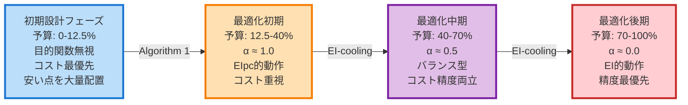
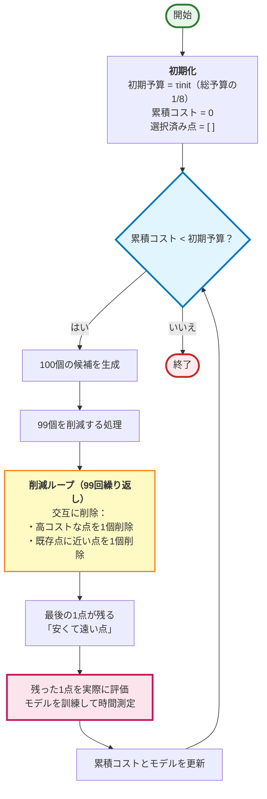
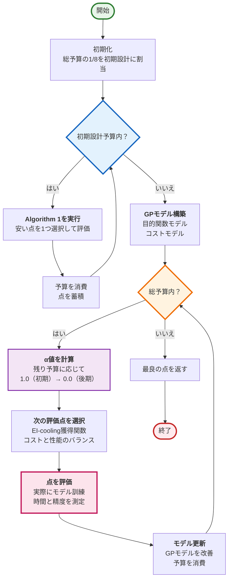

# CArBO: Cost Apportioned BO

## 1. CArBOの革新

### 従来手法の問題
- **EI**：コストを無視、高コスト点ばかり評価
- **EIpc**：最適解が高コストだと性能悪化

### CArBOの解決策
1. **初期設計**：安い点を多数配置して情報収集
2. **コストクーリング**：徐々にコスト制約を緩和
3. **結果**：同一予算で約40%のコスト削減

### 重要な理解
- コスト関数は未知でOK（オンライン学習）
- 100点生成するが評価は1点のみ
- 「安くて遠い」点が自動的に選ばれる仕組み
- 初期は情報収集、後期は最適化に集中

## 2. CArBOの核心：2段階戦略

**「初期は目的関数を無視してコスト効率的に情報収集、後期は徐々にコスト制約を緩和して最適解を探索」**

### フェーズ1：初期設計（予算0-12.5%）
- **目的**：探索空間の情報収集
- **方法**：目的関数を無視、コスト最優先で安い点を大量配置
- **結果**：同一予算で従来4点→15点の評価が可能

### フェーズ2：最適化（予算12.5-100%）
- **方法**：EI-cooling（α値が1.0→0.0へ減衰）
- **初期**：コスト重視（EIpc的）
- **後期**：精度重視（EI的）

### 時間軸での戦略変化

## 2. コスト効率的な初期設計（Algorithm 1）

### 目的と前提
- **目的**：限られた予算内で、探索空間を均等にカバーする点集合を構築
- **重要な前提**：コスト関数は未知（評価して初めて判明）

### Algorithm 1の動作

### 削除基準の詳細

#### 高コスト削除
- GPモデルで100点のコストを予測（実計算ではない）
- 最も高い予測値の点を削除
- データ不足時（最初の1-2反復）はランダム削除

#### 近接点削除
- 各候補と既存点の距離を計算
- 最も近い点を削除（空間を均等にカバーするため）

### 重要な理解ポイント

- **候補点の「座標」**：ハイパーパラメータの組み合わせ（例：learning_rate=0.01, layers=3）
- **「評価」**：実際にモデルを訓練して性能とコストを測定
- **100点の扱い**：生成（座標）→予測（ミリ秒）→削除（配列操作）→評価（1点のみ、数秒〜数分）

## 3. コストクーリング（EI-cooling）

### 定式化

$$
\text{EI-cool}(x) = \frac{\text{EI}(x)}{c(x)^{\alpha}}
$$

$$
\alpha = \frac{\tau - \tau_k}{\tau - \tau_{\text{init}}}
$$

ここで：
- $\tau$：総予算
- $\tau_k$：現在までの使用予算
- $\tau_{\text{init}}$：初期設計の予算
- $\alpha$：1.0 → 0.0 へ減衰するパラメータ

### 動作原理
- **α ≈ 1.0（初期）**：EIpc的、コスト効率最重視
- **α ≈ 0.5（中期）**：バランス型、コストと性能を両立
- **α ≈ 0.0（後期）**：純EI、コスト無視で最適解追求

## 4. 完全なアルゴリズム（Algorithm 2）

