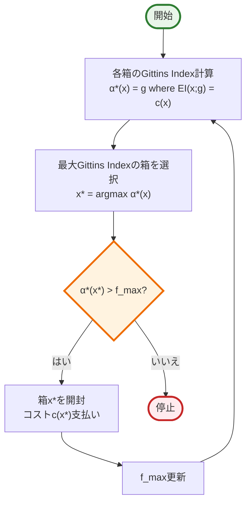
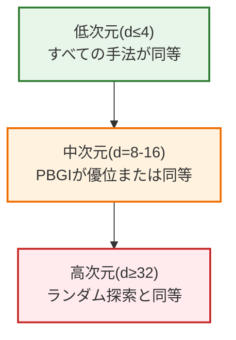

# PBGI (Pandora's Box Gittins Index) 解説

## 1. PBGIの革新

### 従来のコスト考慮BO手法の問題点

#### EIPC (Expected Improvement Per unit Cost)
- **長所**: シンプルで計算効率的、実用的に広く使用
- **短所**: 理論的に最適でない、低コスト領域を過剰サンプリング
- **問題例**: 高分散・高コストの点より、低分散・低コストを選ぶ傾向

#### 多段階先読み手法 (BMSEI等)
- **長所**: ベイズ最適化で将来の評価を考慮した理論的に優れた性能
- **短所**: 計算コストが指数的に増大、数値的に不安定、実装が複雑
- **例**: BMSEI (Budgeted Multi-Step Expected Improvement) - 予算制約下で複数ステップ先を考慮

### PBGIの解決策

**「Pandora's Box問題の理論を活用し、理論的基盤と計算効率を両立」**

- 経済学のPandora's Box問題とBOの新たな接続を発見
- Gittins indexによるベイズ最適方策を獲得関数として活用
- 結果：中～高次元問題で優れた性能を実証

## 2. Pandora's Box問題とGittins Index

### 2.1 Pandora's Box問題

```
設定：N個の箱があり、各箱iについて：
- 報酬f(x)は確率分布Fi（既知）から生成
- 開封コストc(x)が必要
- 目的：純利益（最良報酬 - 総コスト）を最大化
```

### 2.2 Gittins Indexの定義

各箱のGittins Index α*(x)は以下の方程式の解：

$$\text{EI}_f(x; g) = c(x)$$

ここで：
- gがGittins Index値
- EIは期待改善関数
- 直感的意味：「この箱の優先度を表す評価指標」（開ける期待利益がコストと釣り合う時の既知最大値）

### 2.3 最適方策



## 3. PBGIアルゴリズム：BOへの適用

### 3.1 離散から連続への拡張


### 3.2 PBGI獲得関数

#### 予算制約版
$$\alpha^{\text{PBGI}}_t(x) = g \text{ where } g \text{ solves } \text{EI}_{f|x_{1:t},y_{1:t}}(x; g) = \lambda c(x)$$

- λ：予算に応じて調整するハイパーパラメータ
- 大きいλ → リスク回避的（探索を抑制）
- 小さいλ → リスク追求的（探索を促進）

#### 適応減衰版 (PBGI-D)
停止ルール発動時にλを減衰：
$$\lambda_{t+1} = \begin{cases}
\lambda_t/\beta & \text{if } f^*_t \geq \alpha^{\text{PBGI}}_t(x^*_t; \lambda_t) \\
\lambda_t & \text{otherwise}
\end{cases}$$

### 3.3 計算方法

```python
# PBGI計算の疑似コード
def compute_pbgi(x, lambda_param):
    # GP予測
    mu, sigma = gp.predict(x)
    cost = c(x)

    # 二分探索でGittins Index計算
    def ei_function(g):
        return expected_improvement(mu, sigma, g)

    # EI(x; g) = λc(x)となるgを探索
    g = bisection_search(
        func=lambda g: ei_function(g) - lambda_param * cost,
        lower=mu - 10*sigma,
        upper=mu + 10*sigma
    )
    return g
```

## 4. 理論的性質

### 4.1 最適性の保証

**定理1 (Weitzman, 1979)**：Pandora's Box問題において、Gittins Index方策はベイズ最適

**定理2**：期待予算制約問題でも、適切なλとタイブレーキング規則により、Gittins Index方策はベイズ最適

### 4.2 λの極限挙動

#### λ → 0の場合
$$\alpha^{\text{PBGI}}_t(x) \approx \mu_t(x) + \sigma_t(x)\sqrt{2\log\frac{\sigma_t(x)}{\lambda c(x)}}$$

- UCB獲得関数に類似
- 信頼区間パラメータが自動調整される形

#### λ → ∞の場合
- EI獲得関数に近づく
- コストの影響が相対的に小さくなる

## 5. 実験結果の要点

### 5.1 性能特性



### 5.2 主要な実験結果

| 問題タイプ | PBGI性能 | 特記事項 |
|-----------|---------|----------|
| ベイズ後悔 (d=8-16) | 最良または同等 | 特に中難易度で優位 |
| 合成関数 (Ackley, Levy) | 優秀 | 多峰性問題で効果的 |
| 実応用 (Pest Control) | 最良 | 高次元(d=25)でも性能維持 |
| Lunar Lander | 優秀 | 未知コストでも対応可能 |
| Rosenbrock | PBGI-Dが優秀 | 単峰性ではEI系が強い |

### 5.3 コスト設定による挙動の違い

#### 一様コスト（通常のBO）
- PBGIは通常のBOでも競争力のある性能
- 設計がコスト考慮型でも汎用性を持つ

#### 変動コスト
- PBGIの真価を発揮
- EIPCと異なる質的な判断が可能

## 6. 実装上の重要点

### 6.1 勾配計算

$$\nabla\alpha^{\text{PBGI}}(x) = \nabla\mu(x) + \frac{\phi(\frac{\mu(x)-\alpha^{\text{PBGI}}(x)}{\sigma(x)})\nabla\sigma(x) - \lambda\nabla c(x)}{\Phi(\frac{\mu(x)-\alpha^{\text{PBGI}}(x)}{\sigma(x)})}$$

- 明示的な解析的勾配が利用可能
- L-BFGS等の勾配法で効率的に最適化

### 6.2 計算効率

- 二分探索：100回反復で十分な精度
- 計算時間：EIより若干遅いが、MSEI/BMSEIより大幅に高速
- 並列化：複数の候補点で独立に計算可能

### 6.3 ハイパーパラメータ選択

| パラメータ | 推奨値 | 影響 |
|-----------|--------|------|
| λ (PBGI) | 10^-4 | 探索-活用のトレードオフ |
| λ0 (PBGI-D) | 10^-1 | 初期の探索度合い |
| β (PBGI-D) | 2 | 減衰速度 |

## 7. PBGIの利点と限界

### 利点

1. **理論的基盤**: Pandora's Box理論による最適性保証
2. **計算効率**: 単純な二分探索で実装可能
3. **汎用性**: コスト有無に関わらず良好な性能
4. **拡張性**: 未知コスト、確率的コストにも対応

### 限界

1. **相関の仮定**: 理論は独立性を前提（実際は事後分布で緩和）
2. **離散化**: 連続領域での理論保証は近似的
3. **パラメータ感度**: PBGIはλに敏感（PBGI-Dで緩和）

## 8. 今後の展望

### 拡張の可能性

- **バッチ設定**: 並列評価への拡張
- **他のGittins Index**: Discounted Gittins Index等の活用
- **理論強化**: 連続領域での収束性証明

### 応用分野

- ハイパーパラメータ最適化（クラウドGPU利用時）
- ロボット制御（エネルギーコスト考慮）
- 材料設計（実験コストが変動）

## まとめ

PBGIは、**経済学のPandora's Box理論とBOを融合**することで、コスト考慮型最適化に**理論的基盤と実用性を両立**した新しい獲得関数。特に**中～高次元の多峰性問題**で既存手法を上回る性能を示し、**計算効率**も実用的。Gittins Index理論の豊富な知見をBOに活用する第一歩として重要な貢献。